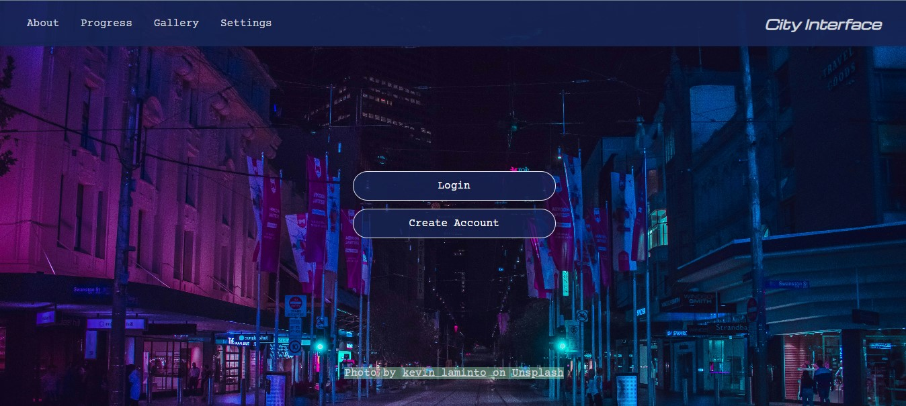
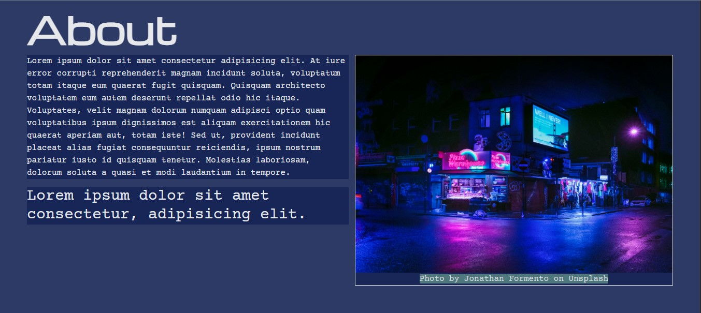
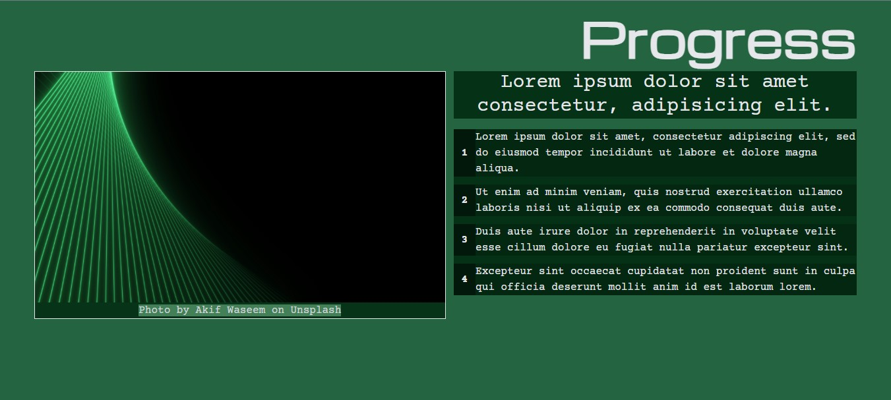

# City Interface
<p align="center">
  
  
  
</p>

🚧 **This project is currently under development.**

This is a simple HTML, CSS, and JavaScript project that I created to experiment with **Tailwind CSS** and explore its utility classes and styling workflow.

I may eventually migrate this project to **React** or recreate it as a **CodePen** project.

## Running the Project
1. Install the project dependencies.
   
2. Run the Tailwind development command:
   
   ```bash
   npm run dev
   ```
   
   This will build/watch the Tailwind CSS output.
   
4. Open `home.html` directly in your browser, **or** use the **Live Server** extension in VS Code.</br>
   I recommend using Live Server for a smoother development experience.

